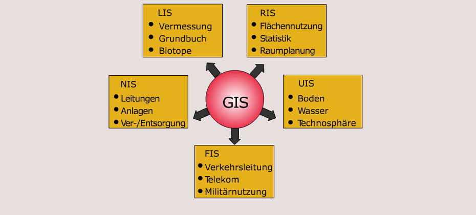

# Einführung

## Grundbegriffe

***GIS***
- Geographisches Informationssystem
- a computerized system that can store, retrieve, manipulate, visualize and analyse spatial data

***Informationssystem***
- Erfassung
- Speicherung
- Aktualisierung
- Verarbeitung
- Wiedergabe

***Geodaten (Spatial Data)***
- Geographische Daten
- Informationen über die Lage und Form (Geometriedaten) einer Erscheinung (Objekt) auf der Erdoberfläche und über die (nicht geometrischen) Eigenschaften (Attributdaten) dieser Erscheinung ([Spektrum](https://www.spektrum.de/lexikon/geographie/geographische-daten/2928)).
- Geodaten beschreiben folgende Merkmale von Geoobjekten:
    - Geometrie
    - Topologie
    - Thematik
    - Dynamik

***Geoobjekt (Features)***
- Ein auf der Erde vorhandenes Objekt, das mittels Geodaten eindeutig referenzierbar ist ([Wikipedia](https://de.wikipedia.org/wiki/Geoobjekt)).

***Attributdaten***
- (nicht geometrischen) Eigenschaften eines Geoobjekte
- Daten ohne spezifischen Raumbezug ([Spektrum](https://www.spektrum.de/lexikon/geographie/attributdaten/558))
	- Bei Rasterdaten entspricht der Wert des Attributs dem gespeicherten Wert der Rasterzelle
	- Bei Vektordaten in der Regel in konventionellen Datenbanken gespeichert

***Layerprinzip***
- Verschiedene Objekt-klassen oder Variablen in Schichtmodell (Layer) miteinander verknüpft
- jede Geometrietyp (oder Attributklasse) wird in eigener Informationsschicht erfasst

***EVAP***
1. Erfassung
2. Verwaltung
3. Analyse
4. Präsentation

## Anwendungsfelder und GIS-Typen

Quelle: http://www.geoinformation.net/lernmodule/folien/Lernmodul_03/Lerneinheit01/index.html

Quelle: http://www.geoinformation.net/lernmodule/folien/Lernmodul_03/Lerneinheit01/index.html

- LIS = Land(schafts)informationssystem (z.B. zur Naturraumausstattung)
- RIS = Rauminformationssystem (z.B. für Regionalplanung)
- KIS = Kommunales Informationssystem (für Planung u. Verwaltung)
- UIS = Umweltinformationssystem (z.B. Umweltüberwachung)
- NIS = Netzinformationssystem (z.B. Kanal-IS, Straßen-IS)
- FIS = Fachinformationssystem (z.B. Boden-IS, ...)

## Raummodelle 

In order to visualize natural phenomena, one must first determine how to best represent geographic space.
Data models are a set of rules and/or constructs used to describe and represent aspects of the real world in a computer.
Two primary data models are available to complete this task: raster data models and vector data models.

***Ziel von GIS***
- rechnergestützte raumbezogene Analysen mit Geodaten. Dazu ist erforderlich: Ein digitales Modell der „Wirklichkeit“.

***Modelle***
- Rastermodell
    - Welt als Reihe von Variablen, die an jeder Stelle einen Wert annehmen
    - Siehe auch Kapitel: [Raster](gis/03-raster.md)
- Vektormodell
    - Welt als leerer Raum, der mit diskreten Objekten (Entitäten) angefüllt ist
    - Siehe auch Kapitel: [Vektor](gis/04-vektor.md)
