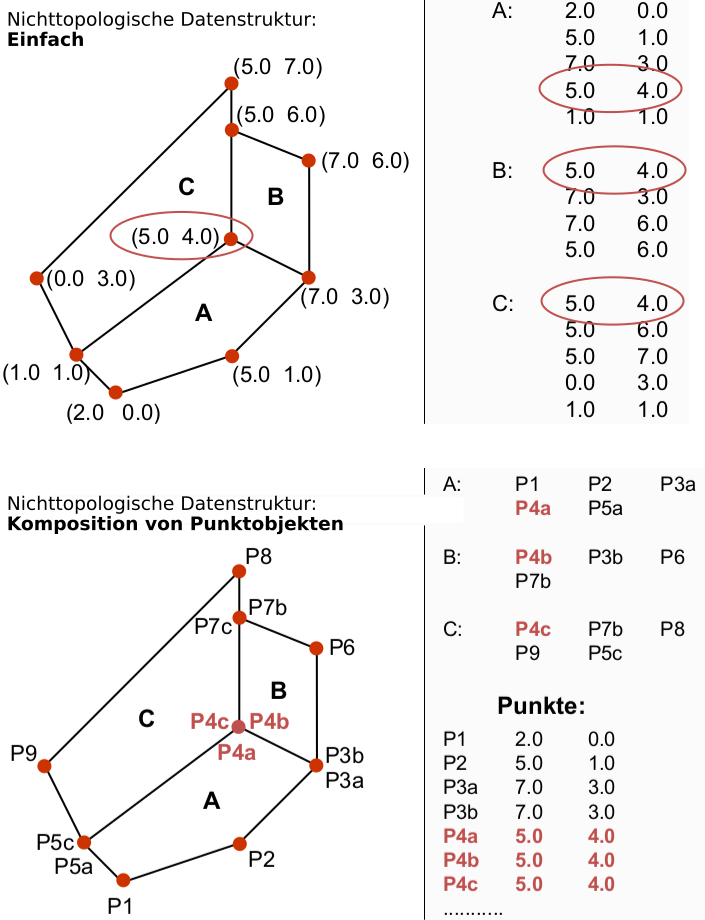

# Vektordaten

## Vektordatenmodell

**Vektordaten** 
- Daten entsprechend des Vektordatenmodells zur Abbildung von Punkten, Linien, Flächen und Körpern auf der Basis von Koordinaten. Neben den Koordinaten als Träger geometrischer Informationen können, je nach Datenformat, weitere objektbezogene Informationen in Form von topologischen, graphischen oder Sachdaten in einem Vektordatensatz enthalten sein ([Spektrum](https://www.spektrum.de/lexikon/kartographie-geomatik/vektordaten/5099)).

**Vektordatenmodell**
- Vektordaten beschreiben raumbezogene Objekte anhand von Punkten
- Geeignet für diskrete Phänomene
- Weniger geeignet für kontinuierliche Phänomene 
- Im Vektordatenmodell wird ein *Punktobjekt* als einzelnes Koordinatenpaar (x/y) erfasst
    - Linieobjekte werden über Listen von Punkten repräsentiert
    - Polygone sind geschlossenen Linienzügen, sowie den Polygonzentroiden (Zentroid)
- Jedes Objekt kann neben seiner Geometrie auch Eigenschaften besitzen (Attributdaten).
    - Im Gegensatz zum Rastermodell sind diese sog. Attributdaten mit dem Objekt selbst verknüpft.
- Im Vektormodell unterscheidet man zwischen topologischen und nichttopologischen Datenstrukturen.
    - Nichttopologische Datenstrukturen (Spaghetti-Datenstrukturen) bilden lediglich die Lage und Form eines Objektes ab (Geometriedaten), enthalten aber keine Informationen über Nachbarschaftsbeziehungen. (nur Geometrie, keine Topologie)
    - Topologische Vektordaten enthalten hingegen zusätzlich Informationen über die räumlichen Beziehungen der Objekte. (Geometrie und Topologie)

Quelle: ([Spektrum](https://www.spektrum.de/lexikon/geographie/vektordaten/8542))

| Vorteil | Nachteile |
| ------- | --------- |
| Scharfe Repräsentation der Geometrie | Komplexität: komplexe Datenstruktur und resultierend daraus komplexe Analysealgorithmen |
| Beliebige unregelmäßige Formen und Rauminhalte | Schwierig zu bearbeiten |
| Kompaktheit: Geringerer Speicherplatzbedarf | |
| Maßstabsunabhängig (keine Einschränkungen bei Zoom) | |

The final advantage of vector data is that topology is inherent in the vector model. This topological information results in simplified spatial analysis (e.g., error detection, network analysis, proximity analysis, and spatial transformation) when using a vector model ([geographic information system basics](https://2012books.lardbucket.org/books/geographic-information-system-basics/index.html)).

### Nichttopologische Vektordatenstrukturen (Spaghetti Modell)

- Reihung von Koordinatenpaaren
    - Punkte (XY-Koordinaten)
    - Linien (Reihe von Punkten, deren erster und letzter ungleiche Koordinaten besitzen)
    - Polygonen (Reihe von Punkten, deren erste und letzte gleiche Koordinate besitzen)

**Vor- und Nachtteile**
- Vorteile
    - einfache Datenstrukture
- Nachteile
    - Topologie nur implizit
    - Fehleranfällig durch Redundanz

Quelle: Vorlesung - Einführung in die Geoinformatik (SS18)

### Topologische Vektordatenstrukturen (Knoten- und Kantenstruktur)

Speichert topologischen Beziehungen explizit

- Adjazenz von Knoten und Kanten
- Adjazenz von Kanten und Maschen
- Adjazenz von Kanten und Kanten
- Adjazenz von Maschen und Maschen

Maschen = Polygone

Adjazenz = Berühren, Aneinandergrenzen (Graphentheorie)

Siehe auch [Graphen und Netzwerke](gis/10-graphen-netzwerke.md)

**Knoten- und Kantenstruktur**
- Knoten (XY-Koordinaten) werden gespeichert
- Kanten (Knotenpaare und angrenzende Maschen) werden separat von Knoten gespeichert

**Vor- und Nachtteile**
- Vorteile
    - Geometrie ist redundanzfrei
    - Topologie ist explizit
    - Bei Änderungen können Fehler leichter vermieden werden
- Nachteil
    - größere Rechenkapazität im vgl. zu zu nichttopologischen Datenstrukuturen wird gebracht

Quelle: Vorlesung - Einführung in die Geoinformatik (SS18)

## Analysemethoden

- Geometrisch
    - Manipulation und Nutzung der Form, Lage und Größe der Vektorfeatures
- Topologisch
    - Analyse der gegenseitigen Lagebeziehungen der Vektorfeatures

### Geometrische Verschneidung (Overlay Operations)

- Vereinigung (Union) = OR
- Überschneidung (Intersection) = AND
- Symmetrische Differenz (Symmetrical difference) = XOR
- Mengen Differenz (Identity)

Quelle: https://2012books.lardbucket.org/books/geographic-information-system-basics/index.html

### Geoprozessierung

Daten werden verändert, aber keine neuen „Informationen“ geschaffen

- Auflösen (Dissolve)
    - Kombiniert mehrere Polygonobjekte zu einem Polygonobjekt, basierend auf einem bestimmten Attributen
- Auswählen (Select)
    - Erstellung eines Ausgabelayers basierend auf einer benutzerdefinierten Abfrage, welche bestimmte Objekte des Eingabelayers auswählt. (Siehe oben: Auswahloperatoren)
- Merge
    - Verbindet gleiche Objekte aus unterschiedlichen Eingabelayern in einem neuen Ausgabelayer
- Append
    - Zusammenführen von Layer mit existierenden Überschneidungsbereichen
- Differenz (Clip)
    - Extrahiert die Objekte eines Eingabelayers (Punkt, Linie oder Polygon), welche in die räumliches Ausdehnung (spatial extent) ein Clip Layers fällt
- Erase
    - Gegenteil von Clip
    - Behält die Objekte eines Eingabelayers (Punkt, Linie oder Polygon), welche außerhalb der räumliches Ausdehnung (spatial extent) ein Clip Layers sind
- Split
    - Teilt einen Eingabelayer in mehrere Ausgabelayer (räumlich unterschiedliche Teilbereiche) auf

### Puffer (Buffer)

**Puffer (Buffer)**
- Das Erzeugen eines Polygonlayers, welcher eine Zone (oder mehrerer Zonen) mit einer bestimmten Breite um ein Eingabe Punkt-, Linie- oder Polygonobjekt

**Eingabe**
- Punkt-, Linie- oder Polygonobjekt
- Breite

**Ausgabe**
- Polygonlayer mit Zonen

**Typen**
- Constant width buffers
- Variable width buffers
    - Pufferbreite wird vorher für jedes Objekt festgelegt
    - Abhängig von Attributen des jeweiligen Objektes

**Multiple ring buffers**
- Serie von konzentrischen Pufferzonen (wie eine Zielscheibe) um ein Objekt.

### Topologische Fehler 

**Sliver Polygone** sind fehlerhaft entstandene Restflächen, die beim räumlichen Verschneiden verschiedener Datenebenen entstehen ([Wikipedia](https://de.wikipedia.org/wiki/Sliver_Polygon)). Zwei Kanten von Polygonen treffen nicht genau aufeinander.

Weitere Fehler sind Offene Polygone, Undershots und Overshots.

---

## Work in Progress

### Nächste-Nachbar-Analyse

k-Nächste-Nachbar-Analyse (euklidische Distanz)

### Geometrisch: Geometrien vereinfachen

Problemstellung:
Ihre Geometrien sind für einen gewünschten
kartographischen Darstellungsmaßstab zu detailliert.
Lösung:
Vereinfachung über (z.B.) den Douglas-Peucker-Algorithmus
zur geometrischen Vereinfachung.

Änderung des Darstellungsmaßstabes und Einsparung von
Speicherplatz (weniger Punkte).

