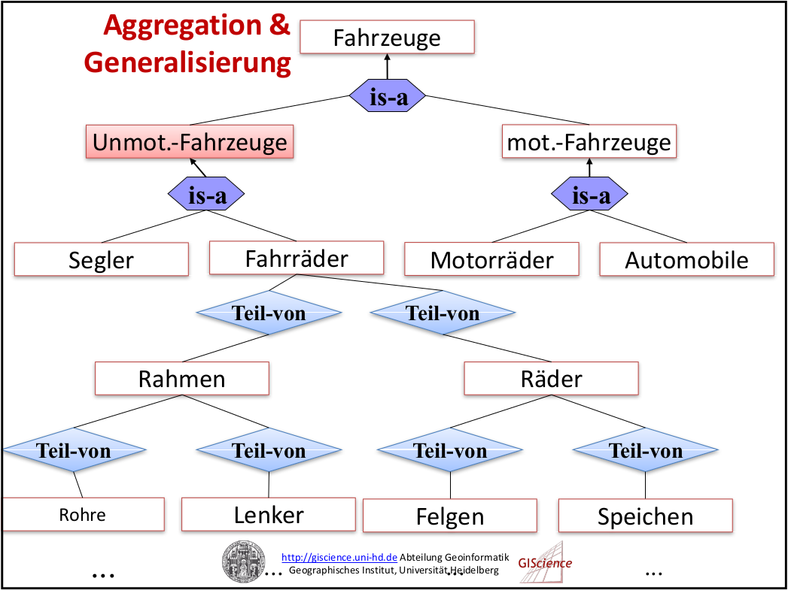

# Datenmodellierung und ERM

***Datenmodell***
- Abbildung der realen Welt in abstrahierter, vereinfachter, strukturierter Weise
- Ein (relationales) Datenmodell wird durch die Abstraktion von einzelnen Objekten (Entitäten), [deren Beziehungen zueinander (Relationen)] und deren Eigenschaften (Attribute) gebildet ([http://geoinformatik.lehrewelt.de](http://geoinformatik.lehrewelt.de/raumliche-datenmodelle-zur-digitalen-abbildung-der-echtwelt/))

## Phasen der Datenmodellierung

1. Konzeptionelles Datenmodell (Datenbankschema)
    - Bestimmung und Benennung der wichtigsten Objekte (Entitäten)
    - Bestimmung der wichtigsten Beziehungen zwischen Objekten (Relationen)
2. Logisches Datenmodell (Datenbankschema)
    - Bestimmung der relevanten Eigenschaften von Objekten (Attribute)
    - Beschreibung des Verhaltens von Objekten (Methoden)
3. Physisches Datenmodell (Datenbankschema)
    - Definition der Datentypen für Objekte und deren Eigenschaften
    - Definition wie Beziehungen implementiert werden sollen (Kardinalitäten)
    - Beschreibung der Operationen und deren Parameter (Methodendefinition/-deklaration)

## Entity-Relationship Modell (ERM)

Das Entity-Relationship-Modell dient dazu, im Rahmen der semantischen Datenmodellierung einen in einem gegebenen Kontext, relevanten Ausschnitt der realen Welt zu beschreiben.

Das ERM besteht aus einer Grafik (ER-Diagramm) und einer Beschreibung der darin verwendeten Elemente, wobei deren Bedeutung (Semantik) und ihre Struktur dargestellt wird ([Wikipedia](https://de.wikipedia.org/wiki/Entity-Relationship-Modell))

### Begriffe

*Objekte und Gegebenheiten der realen Welt:*

- ***Entität (Entity)***
    - individuell identifizierbares Objekt der Wirklichkeit
    - z. B. der Angestellte Müller oder das Projekt 3232
- ***Beziehung (Relationship)***
    - Beziehung zwischen zwei oder mehreren Entitäten
    - z. B. Angestellter Müller leitet Projekt 3232
- ***Eigenschaft (Attribute)***
    - Eigenschaft von einer Entität
    - z. B. das Eintrittsdatum des Angestellten Müller.

*Im Rahmen der Modellierung werden geichartige Typen gebildet:*

- ***Entitätstyp***
    - Typisierung gleichartiger Entitäten
    - z. B. Angestellter, Projekt, Buch, Autor, Verlag
- ***Beziehungstyp (Relationship-Typ)***
    - Typisierung gleichartiger Beziehungen
    - z. B. Angestellter leitet Projekt
***Attribut***
    - Typisierung gleichartiger Eigenschaften
    - z. B. Nachname, Vorname und Eintrittsdatum im Entitätstyp Angestellter.

***Kardinalitäten***
- Die Kardinalität legt (auf der Ebene Beziehungstyp) für jeden der beteiligten Entitätstypen fest, an wie vielen konkreten Beziehungen (dieses Typs) seine Entitäten beteiligt sein können oder müssen ([Wikipedia](https://de.wikipedia.org/wiki/Entity-Relationship-Modell)).
- Es existieren unterschiedliche Notationsformen
- Chen-Notation
    - 1:1
    - 1:n
    - m:n

Quelle: https://de.wikipedia.org/wiki/Entity-Relationship-Modell

### Vor- und Nachteile

***Vorteile***
- einfach und intuitiv
- einfach abzubilden auf relationales Modell
- weite Verbreitung

***Nachteile***
- geringe Ausdrucksfähigkeit
- formal nicht eindeutig
- keine Spezifikation von Verhaltensaspekten

### Spezialisierung und Generalisierung (is-a-Beziehung)

Bei der ***Spezialisierung*** wird ein Entitätstyp als Teilmenge eines anderen Entitätstyps erkannt und deklariert, wobei sich die spezialisierte Entitätsmenge durch besondere Eigenschaften (nur für sie geltende Attribute und/oder Beziehungen) gegenüber der übergeordneten, generalisierten Menge auszeichnet ([Wikipedia](https://de.wikipedia.org/wiki/Entity-Relationship-Modell)).

### Aggregation und Zerlegung (is-part-of-Beziehung)

Werden mehrere Einzelobjekte (z. B. Person und Hotel) zu einem eigenständigen Einzelobjekt (z. B. Reservierung) zusammengefasst, dann spricht man von ***Aggregation***. Dabei wird das übergeordnet eigenständige Ganze Aggregat genannt; die Teile, aus denen es sich zusammensetzt, heißen Komponenten. Aggregat und Komponenten werden als Entitätstyp deklariert ([Wikipedia](https://de.wikipedia.org/wiki/Entity-Relationship-Modell))

***Aggregation vs. Generalisierung***

Aggregation und Generalisierung bilden Hierarchien aber:

1. Aggregation bezieht Objekte aufeinander
2. Generalisierung bezieht Klassen aufeinander

