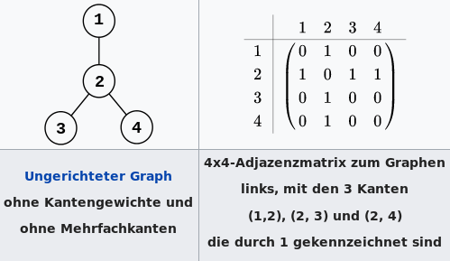

# Graphen und Netzwerkanalyse

## Topologie

***Topologie***
- Beschreibt die gegenseitige Lage und Anordnung geometrischer Gebilde im Raum
    - Beschreibung der Relationen zwischen elementaren Objekten (Knoten, Kante, Masche)
- charakterisiert nichtmetrische, räumliche Beziehungen zwischen Geoobjekten (Nachbarschaftsbeziehungen)
    - Ermöglicht die koordinatenfreie Speicherung von Objekten

***Topologische Invarianten***
- Ein Knoten ist Endpunkt einer Kante
- Zwei Kanten kreuzen sich/ sind kreuzungsfrei
- Ein Punkt liegt im Inneren einer Fläche
- Ein Punkt liegt auf dem Rand einer Fläche
- Eine Fläche hat ein Loch
- Eine Fläche ist zusammenhängend/ nicht zusammenhängend
- Zwei Flächen sind benachbart

***Nicht-topologische Eigenschaften***
- Abstand
- Fläche
- Winkel
- Umfang
- Durchmesser

### Topologische Beziehung nach Egenhofer

***Egenhofer Relationen***
- A disjoint B 
- A contains B
- A inside B 
- A equals B
- A touches B
- A covers B
- A is covered by B
- A overlaps B

Quelle: https://github.com/rugbyprof/4553-Spatial-DS/wiki/Topological-Relationships

## Graphentheorie

Die Graphentheorie liefert ein mathematisches Fundament für die einheitliche Darstellung und Analyse unterschiedlicher Netzwerke. Daher beschränkt sich ein Graph vorwiegend auf die Modellierung von Beziehungen seiner Elemente, der Konnektivität. Konnektivität ist eine topologische Eigenschaft.

***Graph***
- Ein Graph ist ein Gebilde aus Knoten (nodes) und Kanten (edges)
	- Eine Kante verbindet immer 2 Knoten
	- Diese Knoten sind die Endpunkte der Kante

***Adjazenz***
- Aneinandergrenzen gleichartiger Primitive
	- Z.B. 2 Knoten über eine Kante, 2 Kanten über einen Knoten

***Inzidenz***
- Aneinandergrenzen unterschiedlicher Elemente
	- Z.B. Knote und Kante

***Adjazenmatrix (Nachbarschaftsmatrix)***
- eine Matrix, die speichert, welche Knoten des Graphen durch eine Kante verbunden sind ([Wikipedia](https://de.wikipedia.org/wiki/Adjazenzmatrix))
- Sie besitzt für jeden Knoten eine Zeile und eine Spalte, woraus sich für n Knoten eine n×n Matrix ergibt

Quelle: https://de.wikipedia.org/wiki/Adjazenzmatrix

***ungerichteter Graph***
- Es werden lediglich die Verbindungen zwischen den Knoten dargestellt (Verbindungsschema)

***gerichteter Graph***
- Es wird zusätzlich dargestellt, in welcher Richtung Verbindungen zwischen den Knoten bestehen

***gewichteter Graph*** (bewerteter)
- Graph, dessen Kanten mit Gewichten bewertet sind (z.B. den Kantenlängen)

***zusammenhängender Graph***
- wenn für zwei beliebige Knoten (mindestens) ein Weg besteht

***vollständiger Graph***
- wenn alle Knotenpaare adjazent sind

***Schleife***
- eine gerichtete Kante in einem gerichteten Graph, die einen Knoten mit sich selbst verbindet

***Baum***
- schleifenloser, zusammenhängender Graph, in dem je zwei beliebige verschiedene Knoten durch genau einen Weg verbunden sind

### Netzwerkanalyse

***Grundprobleme***
1. Bester-Weg-Problem
2. Bester-Standort-Problem
3. Problem des Handlungsreisenden (Traveling Salesman Problem)
    - Die Aufgabe besteht darin, eine Reihenfolge für den Besuch mehrerer Orte so zu wählen, dass keine Station außer der ersten mehr als einmal besucht wird, die gesamte Reisestrecke des Handlungsreisenden möglichst kurz und die erste Station gleich der letzten Station ist ([Wikipedia](https://de.wikipedia.org/wiki/Problem_des_Handlungsreisenden)).

## GIS Funktionen für Netzwerke

GIS beinhalten Werkzeuge zur Erstellung korrekter ***Netztopologien***.

- Unterstützung von ***Kantengewichten***
- ***Katenübergänge (Turns)***
    - An Knoten bestehen mehrere Möglichkeiten, von einer Kante zur anderen zu wechseln
    - Modellierung von Abbiegevorschriften und Stops
- ***Einzugsgebiet (Service Area)***
- ***Erreichbarkeitsanalyse (Isochronen)***
    - Berrechnung eines Polygons, das das innerhalb einer vorgegeben Zeit zu erreichende Gebiet repräsentiert
- ***Lokation-Allokation-Modellierung***
    - Location-allocation refers to algorithms used primarily in a geographic information system to determine an optimal location for one or more facilities that will service demand from a given set of points ([Wikipedia](https://en.wikipedia.org/wiki/Location-allocation))
    - Wenn Einrichtungen, die Waren und Services bereitstellen, und verschiedene Bedarfspunkte, welche diese nutzen, gegeben sind, dann besteht das Ziel der Location-Allocation darin, diejenigen Einrichtungen zu suchen, die die Bedarfspunkte am effizientesten bedienen. Wie der Name bereits sagt, bezeichnet Location-Allocation eine Problemstellung mit zwei Aspekten, wobei gleichzeitig Einrichtungen gesucht und Bedarfspunkte den Einrichtungen zugeordnet werden ([ArcMap - Werkzeuge](https://desktop.arcgis.com/de/arcmap/latest/extensions/network-analyst/location-allocation.htm))
    - z.Bsp: Viele Einzelhandelsgeschäfte beziehen ihre Güter von Industriebetrieben. Gleichgültig, ob Autos, Küchengeräte oder Nahrungsmittel produziert werden, können für einen Industriebetrieb große Anteile seines Budgets auf Transportkosten entfallen. Location-Allocation kann die folgende Frage beantworten: Wo sollte sich der Industriebetrieb ansiedeln, um die Gesamttransportkosten zu minimieren ([ArcMap - Werkzeuge](https://desktop.arcgis.com/de/arcmap/latest/extensions/network-analyst/location-allocation.htm))?

### Distanzen in Netzwerken

***Geometrische Distanzen***
- Euklidische Metrik (Satz von Pythagoras)
- Cityblockmetrik (N4-Nachbarschaftstyp)
- Schachbrettmetrik (N8-Nachbarschaftstyp)

Was ist die Distanz zwischen 2 Polygonen?
- Minimal (Rand zu Rand)
- Zentroid (Schwerpunkt zu Schwerpunkt)

***Distanzen in Netzwerken (topolog. Graphen)***
- Anzahl der Knoten eines Weges in einem Graph
- Summe der Gewichte für Wegkosten auf Kanten zwischen Start- u. Zielknoten

### Routenplanung

***Motivation***
- ist der Wunsch, optimal im Sinne seiner persönlichen Bedürfnisse und der gewählten Fortbewegungsart von seinem Standort zu einem bestimmten Zielort zu gelangen.  

***Bedüfnisse***
- anzukommen
- schnell
- wenig Energie
- wenig Gefahrenstellen
- Zwischenziele

***Fortbewegungsarten (Verkehrsmodalitäten)***
- Fahrrad
- Auto
- zu Fuß
- Schiff
- Eisenbahn
- Flugzeug
- ...

***Individualisierte Routenplanung***
- Ermittlung der Kantenkosten mit einer anwenderspezifischen Formel
- `Kantenkosten = x * Distanz + y * Steigung + z * Panorama +...`
    - Für Fahrradbote: `x >> y >> z`
    - Für Tourist: `z >> y >= x`

Siehe auch: https://maps.openrouteservice.org/
