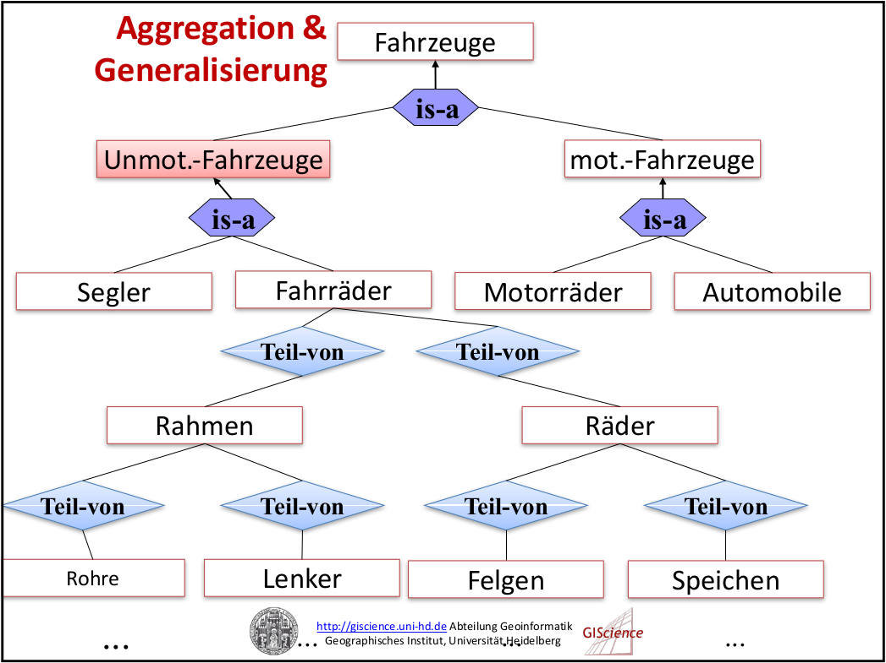

# Klausur - Antworten

Siehe auch: [Klausur - Fragen](gis/klausur-fragen.md)

## WS 12/13

**1.**

1. Semantische Metadaten
    - Beschreibung der verwendeten Symbolik?
2. Syntaktische
    - Zugriffsmechanismen?

**2.**

Aggregation und Generalisierung bilden Hierarchien aber:

1. Aggregation bezieht Objekte aufeinander
2. Generalisierung bezieht Klassen aufeinander

**3.**

- Entwicklung („Lineage“): 
    - die historische Entwicklung eines Datensatzes.
- Vollständigkeit („Completeness“):
    - die Vollständigkeit eines Datensatzes.
- Logische Konsistenz („Logical Consistency“):
    - beinhaltet sowohl topologische Konsistenz als auch die Attributierung und die Beziehungen innerhalb der DB.
- Positionsgenauigkeit („Positional Accuracy“):
    - auf Koordinaten bezogen.
- Zeitliche Genauigkeit („Temporal Accuracy“):
    - „Accuracy of Measurement“: Genauigkeit von Zeitangaben
    - „Temporal Consistency“: Korrekte zeitliche Reihenfolge der Daten.
    - „Temporal Validity“: Gültigkeit der Daten an bestimmtem Zeitpunkt.
- Thematische Genauigkeit („Thematic Accuracy“):
    - die richtige syntaktische Attributierung („Syntactic Accuracy“), als auch die http://giscience.uni-hd.de Abteilung Geoinformatik Institut, korrekte Zuordnung von Geographisches Objekten zu Universität ihren Heidelberg Objektklassen („Semantic Accuracy“).

**4.**

- DHM = Digitales Höhenmodell
    - Bei einem DHM muss immer angegeben werden, um welche Oberfläche es sich handelt,
    - z.B. DHM der Vegetationsoberfläche. DHM der Erdoberfläche, DHM der Grundwasserfläche
- DOM = digitale Oberflächenmodell (engl. digital surface model - DSM)
    - repräsentiert die Erdoberfläche (Grenzschicht Pedosphäre -Atmosphäre) samt aller darauf befindlicher Objekte (Bebauung, Straßen, Vegetation, Gewässer usw).
- DLM = Digitales Landschaftsmodell
    - beschreiben die Erscheinungsformen und Sachverhalte der Erdoberfläche durch geotopographische Objekte in unterschiedlichen Detaillierungsgraden.
- DGM = Digitale Geländemodelle 
    - beschreibt die Geländeformen der Erdoberfläche durch eine in Lage und Höhe georeferenzierte Punktmenge
- DKM = Digitales Kartographisches (Landschafts)Modell
    - Teil von ATKIS. Diente dem Ziel verscheidener Maßstäbe automatisch aus dem digitalen Landschaftsmodell abzuleiten.

**5.**

**Vektor:**

| Vorteil | Nachteile |
| ------- | --------- |
| Scharfe Repräsentation der Geometrie | Komplexität: komplexe Datenstruktur und resultierend daraus komplexe Analysealgorithmen |
| Beliebige unregelmäßige Formen und Rauminhalte | Schwierig zu bearbeiten |
| Kompaktheit: Geringerer Speicherplatzbedarf | Weniger geeignet für kontinuierliche Phänomene |
| Maßstabsunabhängig (keine Einschränkungen bei Zoom) | |
| Geeignet für diskrete Phänomene | |

The final advantage of vector data is that topology is inherent in the vector model. This topological information results in simplified spatial analysis (e.g., error detection, network analysis, proximity analysis, and spatial transformation) when using a vector model ([geographic information system basics](https://2012books.lardbucket.org/books/geographic-information-system-basics/index.html)).

**Raster:**

| Vorteil | Nachteile |
| ------- | --------- |
| Technologisch schnelle und günstige Erfassung von Daten | große Dateien: großer Speicherplatzbedarf |
| Einfache Datenstruktur und resultierend daraus einfache Analysealgorithmen | Maßstabsabhängig (Einschränkungen bei Zoom) |
| Geeignet bei kontinuierlicher Phänomenen | Probleme in der Beschreibung linienhafter Objekte |
| | Weniger geeignet für diskrete Phänomene |
| | Es gibt keine Information über die Beziehungen zu Nachbarobjekten |

**6.**

- Vorteile
    - Ladensweitedatensätze vorhanden
    - aktives System (Laser)?
    - Bodenpunkte möglich (durch Lücken in der Vegetation)
    - Anschauliche Visualisierungen in Verbindung mit Luftbildern
- Nachteile
    - Attributlose Punktwolke
    - Nachträgliche Objektbildung erforderlich

**7.**

Standorteigenschaften:

- Entfernung zu anderen Krankenhäuser
- Bevölkerungsdichte
- Entfernung zu Hauptstraßen

**8.**

- Gewichtete Graphen
- _
    1. Grünster Weg
    2. Interessantester Weg (Sight seeing)
    3. Schnellster Weg
    4. Kürzester Weg
    5. Der Weg mit dem grinsten Verbrauch
    6. Der Weg mit dem wenigsten Lärm

## WS 12/13 (zweiter Klausurtermin)

**1.**

siehe Klausur WS 12/13 Aufgabe 3

**2.**
