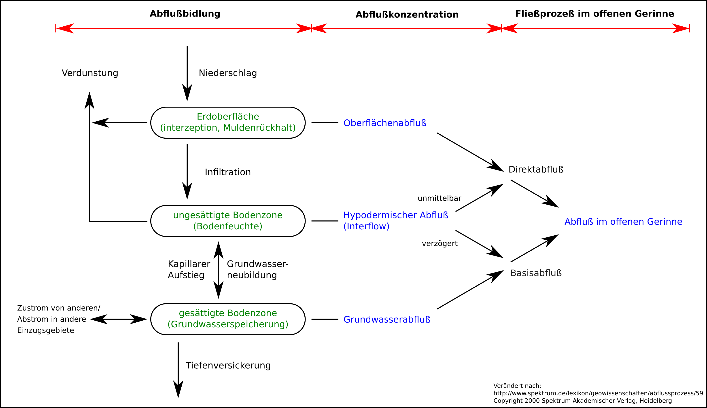

# Abfluss und Durchfluss

**Abfluss**
- Oberflächenabfluss + Grundwasserabfluss

**Durchfluss**
- Oberflächenabfluss
  - "Fluss durch ein Querschnitt"

## Termini

**Infiltrationsüberschuß**
- auch: Hortonscher Oberflächenabfluß
- Erdoberfläche ist für den Niederschlag schwer durchlässig

**Sättigungsflächenabfluß**
- gesättigter Boden ist für den Niederschlag schwer durchlässig

## Bildung

- $q=\frac{Q}{A_{Eo}}\ [\frac{l}{\frac{s}{km}}$
  - $q=\text{Abflußspende}$
  - $Q=\text{Durchfluß/Abfluß}$
  - $A_{Eo}=\text{Fläche des Einzugsgebietes}$

## Schema

## Fragen

- wie entsteht Abfluß?
- welches sind die dominierenden Abflußbildungsprozesse, woher kommt der Abfluß
(Herkunftsräume), und welche Abflußkomponenten gibt es?
- wie ändern sich die Abflußkomponenten bei Nutzungsänderungen?
- wie kann Abfluß gemessen werden?
- zeitliche und räumliche Variabilität des Abflusses, Abflußregimes
- Auftreten von Hoch- und Niedrigwasser
