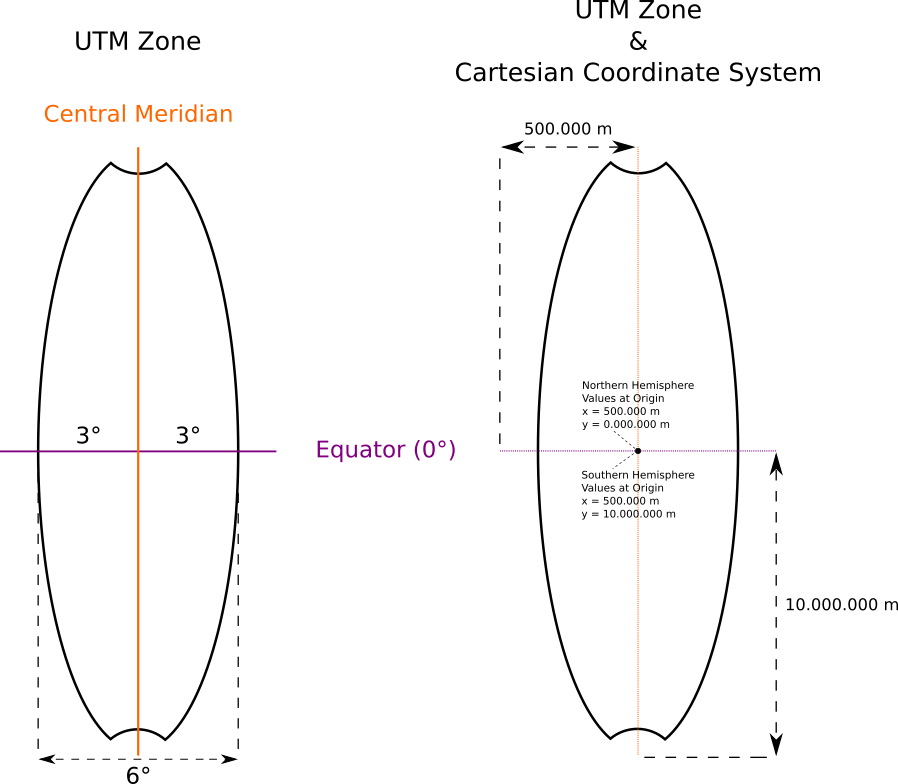
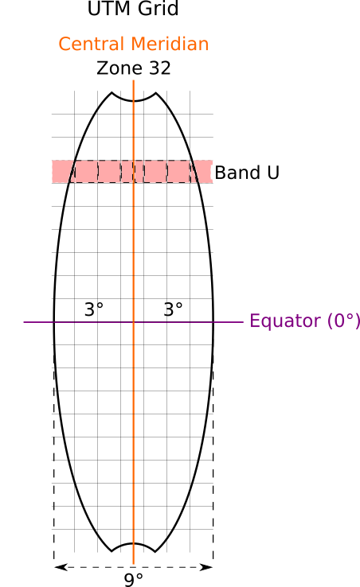

# Geographic Coordinate Systems

**geocentric coordinates**
-  Earth-centered system of locating objects in the solar system in three-dimensions along the Cartesian X, Y and Z axes [Wikipedia](https://en.wikipedia.org/wiki/Geocentric_coordinates)

**geographic coordinates**
- enables every location on Earth to be specified by a set of numbers, letters or symbols ([Wikipedia](https://en.wikipedia.org/wiki/Geographic_coordinate_system))
- used to specify a location on a two-dimensional map
  - requires a [map projection](http://kollektive-geographie-heidelberg.de/kartographie/04-cartographic-projections.html)

**geographic poles**
- defined by the rotational axis

**equator**
- the section perpendicular to the rotational axis and through the center of the ellipsoid

## Geographic Coordinates (latitude/longitude)

| Representation | Example | Description |
| ----------- | -------- | ------------ |
| hddd° mm′ ss.ss″ | N46°14′06.70″ E008°00′55.60″ | degree (°), minutes (′), seconds(″) and decimal seconds |
| hddd° mm.mmm′ | N46°14.11182′ E008°00.92670′ | degree(°), minutes(′) and decimal minutes|
| hddd.ddddd° | N46.235197° E008.015445° | degree(°) and decimal degree |

*h* = cardinal direction
*d* = degree
*m* = minutes
*s* = seconds

**lines of latitude**
- sections perpendicular to the rotational axis are parallel to the equator
- the degrees of latitude range from 90°S over 0° to 90°N (180 lines of latitude)
- φ

**lines of longitude (meridians)**
- sections through the poles
- the degree of longitude range from 180°W over 0° to 180°E
- steps are 10° (360 lines of longitude)
- λ

**prime meridian**
- the meridian through Greenwich

**great circles**
- sections through the center of the ellipsoid
- 1° on a great circle corresponds to about 111 km
  - 360° correspond to 40073 km ≈ 2π ∙ 6378 km

## Universal Transverse Mercator (UTM) Coordinates

### UTM Zone Coordinates

| Example | Description |
| ------- | ----------- |
| 32 N 439596 /  5967780 | zone, north hemisphere, easting /  northing in meter |

**lines of longitude**
- degrees range from 0° to 180°

**lines of latitude**
- degrees range from 80° S over 0° to 84° N
  - The polar regions are excluded

**zones**
- 60 zones, each 6° of longitude in width
- first zone (1)
  - longitude 180° to 174° W
  - starts international Date Line (180°)
- zone numbering increases eastward
- last zone (60)
  - longitude 174° to 180° E

**central meridian**
- longitude line in the middle of a zone
- steps are 6°, starts at 3°
  - 3°, 9°, 15°, ..., 177°

**coordinate system**
- each UTM zone is regarded as an individual Cartesian Coordinate System
- intersection of the equator with the central meridian is the origin of the Coordinate System

**false easting**
- the easting of the central meridian is shifted by 500.000 meters
- eliminates negative numbers

**false northing**
- the northing on the southern hemisphere is shifted by 10.000.000 meters
- eliminates negative numbers

**example 1**

32 N 439596 /  5967780

- The coordinate is on the north hemisphere (N) in UTM zone 32 
  - 32 zone = central meridian is at 9° eastern longitude
- The point located *60404* meters west of the central meridian of zone 32
  - 500000 m - 439596 m = *60404* m
- The point is located 5967780 meters from equator to the North

**example 2**

32 S 439596 /  4032220

- The coordinate is on the southern hemisphere (S) in UTM zone 32 
  - 32 zone = central meridian is at 9° eastern longitude
- The point located *60404* meters west of the central meridian of zone 32
  - 500000 m - 439596 m = *60404* m
- The point is located *5967780* meters from equator to the North
  - 10000000 m - 4032220 = *5967780* m

### UTM Grid Coordinates

| Example | Description |
| ------- | ----------- |
| 32 U 439596 /  5967780 | zone, band, easting /  northing in meter |

**band (latitude)**
- indicates geographical latitude
- 8° hight

## MGRS

- UTM zones independent of the UTM bands, are divided into squares (100 km x 100 km)
- parallel to the central meridian
- denominated with letter pairs

**Military Map Reading 201**
- http://earth-info.nga.mil/GandG/coordsys/mmr201.pdf

## Gauß-Krüger-Coordinates

https://de.wikipedia.org/wiki/Gau%C3%9F-Kr%C3%BCger-Koordinatensystem

## further reading and videos

**Intro to coordinate systems and UTM projection**
- https://www.youtube.com/watch?v=HnWNhyxyUHg

**NOAA - UTM**
- https://www.ngs.noaa.gov/TOOLS/utm.html

**Display Formats of UTM Coordinates - How to Deal with Them? (english & german)**
- http://www.killetsoft.de/t_0901_e.htm

**reddit - What is the difference between UTM and MGRS coordinate systems?**
- https://www.reddit.com/r/CampingandHiking/comments/124y3c/map_question_what_is_the_difference_between_utm/
