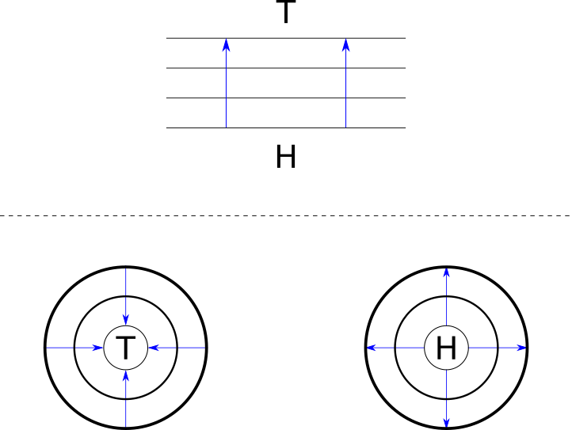
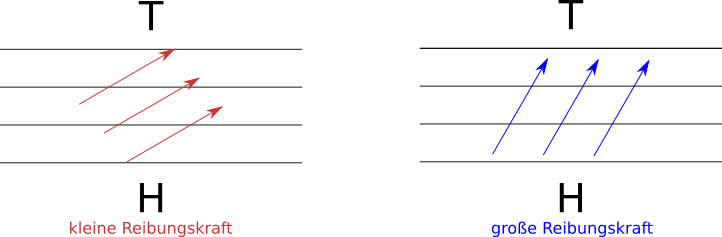
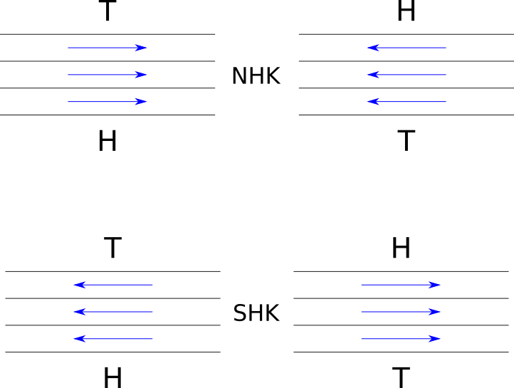
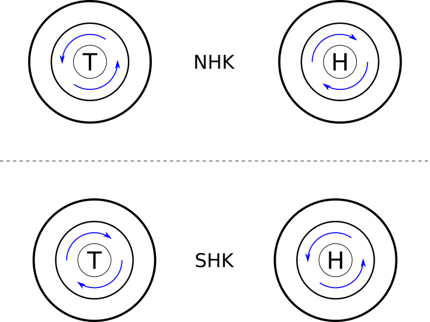
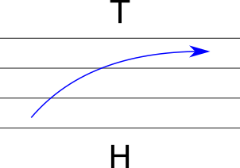
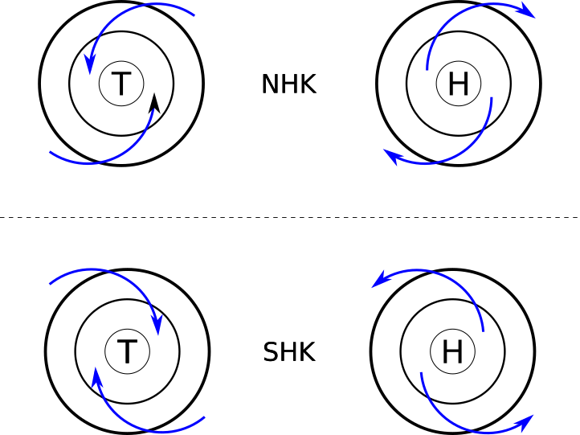
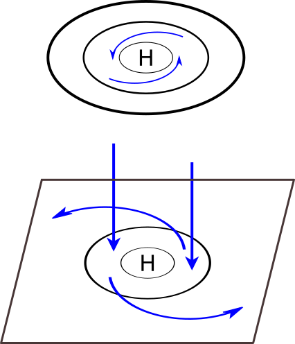

# Luftdruckgebiete und Windsysteme

## Druck

**Druck**

- $$p$$
- $$Pa$$
- gibt an welche Kraft auf eine Fläche von einem Quadratmeter wirkt.
- $$Normaldruck=1013hPa$$

**Isobar**

- Linien gleichem Druck

**Isotherm**

- Linien gleicher Temperatur

**Barotropie**

- Isobare und Isotherme liegen parallel zueinander

**Baroklinität**

- Isobare und Isotherme liegen nicht parallel zueinander

**Tiefdruckgebiet**

- hohe Lufttemperatur = geringere Luftdichte

**Hochdruckgebiet**

- geringe Lufttemperatur = höhere Luftdichte

**thermisches Druckgebilde**

- Kältehoch (h) und Hitzetief (t)
- temperaturabhängigen Dichteänderungen der Luft
- entgegengesetzte Druckgradienten bei Zirkulation
- Antrieb
  - Temperaturdifferenzen zweier Luftmassen
- Vertikalerstreckung
  - 1,5 - 3 km
- Beweglichkeit
  - stationär

**dynamisches Druckgebilde**

- dynamische Hoch (H)- und Teifdruckgebiete (T)
- Entstehung durch die Dynamik der Luftströmungen (Höhenströmung)
  - an der planetarischen Frontalzone und anschließende Wanderung nach Osten
- gleichgesetzte Druckgradienten über gesamte Vertikalerstreckung
- Antrieb
  - Dynamik der Höhenströmung
- Vertikalerstreckung
  - vom Boden bis Troposphäre

**homogenes Druckfeld**

- homogene Schichtung der Isobaren

**radialsymetrisches Druckfeld**

- Krümmung der Isobaren um eine Hoch-/ Tiefdruckgebiet

**Zyklonal**

- Isobaren krümmen sich um ein Tiefdruckgebiet
- Aufgleitbewegungen werden unterstützt

**Antizyklonal**

- Isobaren krümmen sich um ein Hochdruckgebiet 
- Abgleitbewegungen werden unterstützt

## Coriolis Kraft

- Scheinkraft
- Wirkt aufgrund der unterschiedlichen Bahngeschwindigkeiten an den verschiedenen Breitegraden
- N-Halbkugel nach rechts (im Uhrzeigersinn)
- S-Halbkugel nach links (gegen Uhrzeigersinn)
- wirkt nur auf große Distanzen & bewegte Objekte
- Am Äquator = 0
- wird stärker mit zunehmendem Breitengrad

*Erklärungsvideo von TheSimpleClub*

- https://www.youtube.com/watch?v=R3BKhX_n7CA

## Windbegriffe

**Wind**

- horizontale Luftdruckunterschiede = Luftbewegungen (Wind)
- horizontaler Windvektor
  - Richtung
  - Geschwindigkeit
    - $$m/s$
- Vertikalwind ist schwer messbar

**Strömungsdynamik**

- abhängig von
  - thermischen Eigenschaften (differentielle Erwärmung)
  - Topographie

**divergierende Luftmassen**

- Auseinanderströmen
- Hochdruckgebiete

**konvergierende Luftmassen**

- Zusammenströmen
- Tiefdruckgebiet

**zyklonale Wetterlagen**

- Isobaren krümmen sich um ein **Tiefdruckgebiet** (Zyklon)
- Aufgleitbewegungen werden unterstützt

**antizyklonale Wetterlage**

- Isobaren krümmen sich um ein **Hochdruckgebiet** (Antizyklonal)
- Abgleitbewegungen werden unterstützt

## Windtypen

**Auf sich bewegende Luftmassen wirken bis zu 5 Kräfte**

1. Druckgradientkraft
2. Corioliskraft
3. Zentrifugalkraft
4. Reibungskraft
5. Schwerkraft

### ageostrophischer Wind

**wirkende Kraft**

- Druckgradientkraft

- Druckausgleich findet direkt vom Hoch zum Tief statt

### antitriptischer Wind

**wirkende Kräfte**

- Druckgradientkraft
- Reibungskraft

- Druckausgleich findet statt

### geostrophischer Wind

**wirkende Kräfte**

- Druckgradientkraft
- Corioliskraft

- kein Druckausgleich findet statt

### geostrophisch zyklostrophischer Wind

**wirkende Kräfte**

- Druckgradientkraft
- Corioliskraft
- Zentrifugalkraft

- kein Druckausgleich findet statt

### geotriptischer Wind

**wirkende Kräfte**

- Druckgradientkraft
- Corioliskraft
- Reibungskraft

- Boden-Hoch -> Höhen-Tief
- Druckausgleich findet statt

### geotriptisch zyklostrophischer Wind

**wirkende Kräfte**

- Druckgradientkraft
- Corioliskraft
- Reibungskraft
- Zentrifugalkraft

- Druckausgleich findet statt

### Verbindung von Boden- und Höhenzirkulation

- Massendefizit in H-Druckgebieten bzw. der Massenüberschuß in T-Druckgebieten muss ausgeglichen werden
- Entstehung einer Verbindung von Bodenzirkulation zur reibungsfreien Höhenzirkulation

## Mesoskalige Windsysteme

**Mesoskalig**

- Größenordnung: 2 - 1000 Kilometer

**mesoskalige Windsysteme**

- Voraussetzung sind autochtone Wetterlagen
- Luft bewegt sich der Gradientkraft folgend (H -> T)
- H und T entstehen aufgrund der unterschiedliche spezifische Wärmekapazitäten der verschiedenen Oberflächen

**mesoskalige Windtypen**

- ageostropischer Wind
- antitriptischer Wind

**mesoskalige Windesysteme**

- Luv-Lee-Windsysteme und Föhn
- Hang-Windsysteme
- Berg-Tal-Windsysteme
- Land-See-Windsysteme
- Stadt-Umland-Windsysteme

### Luv-Lee-Windsysteme und Föhn

### Hang-Windsysteme

1. Ein in südlicher Richtung exponierter Hang wird sich tagsüber bei Schönwetter stärker erwärmen als die umgebende atmosphärische Luft
2. Ausbildung eines thermischen Tiefs im Hangbereich
3. in gewisser Distanz davon ein thermisches Hoch
4. Nachts ist es umgekehrt (Windrichtung dreht sich)

- **anabatischer Wind**
  - Hangaufwind
  - Tagsüber
- **katabatischer Wind**
  - Hangabwind
  - Nachts

## Makroskalige Windsysteme

**Mesoskalig**

- Größenordnung: über 1000 Kilometer

**makroskalige Windtypen**

- ageostrophischer Wind (nur in Äquatornähe, da Corioliskraft = 0)
- antitriptischer Wind (nur in Äquatornähe, da Corioliskraft = 0)
- geostrophischer Wind
- zyklostrophischer Wind
- geotriptischer Wind

**makroskalige Winde**

- Passat
- Monsum
- Westwindzone

 

------

Lade dieses Kapitel als [PDF](http://kollektive-geographie-heidelberg.de/klimageographie/04-luftdruckgebiete-windsysteme.pdf) herunter

Lade die ganze Rubrik *klimageographie* als [PDF](http://kollektive-geographie-heidelberg.de/klimageographie/klimageographie.pdf) herunter

------
