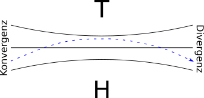

# Atmosphärische Zirkulation

## Termini

**planetare Grenzschicht**

- auch atmosphärische Grenzschicht oder Peplosphäre
- Teil der Erdatmosphäre in den Turbulenzen aufgrund der Erdoberfläche entstehen können

**atmosphärische Zirkulation**

- planetarische Zirkulation
- globale Zirkulation
- globale Windsysteme
  - großräumige vertikale und horizontale Luftbewegungen
- Entstehung aufgrund ungleicher Verteilung von solarer Einstrahlung

**Front**

- Grenze zwischen kalten und warmen Luftmassen
- Kaltfront
  - bewegen sich schneller als Warmfronten
- Warmfront

**Okklusion**

- Vereinigung zweier Fronten

**Frontalzone**

- Planetarische Frontalzone (Westwindzone)

**Polarfront**

- Polseitiger Bereich der planetarischen Frontalzone
- findet häufig Zyklogenese statt

**Subtropenfront**

- Dem Äquator zugenwanter Bereich der planetarischer Frontalzone

**Zonalzirkulation**

- großräumiges Windsystem
- Hauptströmungsrichtung ist zonal (Breitenkreis)

**Meridionalzirkulation**

- großräumiges Windsystem
- Hauptströmungsrichtung ist meridonal (Längenkreis)

**Massenträgheit**

- Wirkt auf einen Körper keine Kraft, so bleibt er in seinem Bewegungszustand zu verharren

## planetarische Frontalzone

- auch planetarische Höhenwestwindzone
- Übergangszone zwischen warmer tropischer Luft und kalter Polarluft in der Troposphäre [Uni-Halle](http://maps.uni-halle.de/mlucampus/geoglossar/terme_datenblatt.php?terme=planetarische%20Frontalzone&typ=)
- 30° - 60°
- Westwinddrift oder Westwendströmung aufgrund der Corioliskraft
- starke meridionalen Temperatur- und Druckdifferenzen (Luftdruckgefälle)
- beeinflusst das Wetter in Mitteleuropa

**Entstehung (4 Phasen)**

1. Zonalzirkulation
   - Vergrößerung des Luftmassengegensatzes zwischen niedere und hohe Breiten
2. Übergang zu turbulenter druckausgleich Strömungen, Ausbilden von Mäanderwellen
3. Meridionalzirkulation
   - Vorstoß von Kaltluft nach Süden
   - von Warmluft nach Norden
   - Abbau des Energieunterschiedes
4. Übergang zu zonaler Strömung (Zonalzirkulation)
   - Abschneiden (cut-off) von Mäandern 
   - Entstehung isolierter Kalt- und Warmluftbereiche
     - -> *Blocking*-*action*

**Blocking-Action**

- Blockierung der planetarischen Westwindströmung (Westdrift)
- Ursache
  - *cut-off* von Kaltlufttropfen und Warmluftinseln 
- Folge
  - Entstehung stationärer H- und T-Druckzellen
  - kann zu autochthone Wetterlagen führen

**Strahlstrom**

- Jetstream
- Starkwindbänder in der Troposphäre
- 150 km/h - 500km/h
- Video
  - https://upload.wikimedia.org/wikipedia/commons/6/62/Aerial_Superhighway.ogv

## Rossby-Wellen

- planetarische Wellen
- mäandrierender Verlauf des Polarfrontjetstreams

## Ryd-Scherhag-Effekt

- Beschreibt Verhalten von Luftströmungen in Bereichen mit zu- oder abnehmenden Luftdruckgradienten [Uni-Halle](http://maps.uni-halle.de/mlucampus/geoglossar/terme_datenblatt.php?terme=Ryd-Scherhag-Effekt)
  - Entstehung von nicht isobaren parallelen Strömung aufgrund der Massenträgheit bei konvergierende und divergierenden Isobaren.
- verstärkt die Mäandrierung der Westwindströmung
- trägt zur Entstehung dynamischen Hoch- und Tiefdruckgebiete in der planetarischen Frontalzone bei

**Beschreibung**

1. Voraussetzungen
   - Geostrophischer Wind
   - Isobaren Parallel
   - Annäherung einer Zone mit extremen Luftdruckgefällen
2. Gradientenkraft wächst mit mit Annäherung an eine Zone maximaler Druckgradienten rasch an
3. Strömungsgeschwindigkeit im Jetstream erfährt eine verzögerte Anpassung aus Trägheitsgründen
4. Die geschwindigkeitsabhängige Corioliskraft kann die Gradientkraft zeitweilig nicht zum isobarenparallelen Gradientwind auszubalancieren
5. Es resultiert ein Lufttransport quer zu den Isobaren (Anisobar) von der warmen zur kalten Seite der Strömung, also eine Luftakkumulation (Konvergenz) auf der kalten und ein Luftdefizit (Divergenz) auf der warmen Seite. 
6. Stromab der Zone maximaler Gradienten passt sich die Strömungsgeschwindigkeit aus Trägheitsgründen erst zeitverzögert an die rasch abnehmenden Druckgradienten an
7. Die Corioliskraft vermag auch hier die Gradientkraft zeitweilig nicht auszubalancieren
8. Es resultiert ein Lufttransporten quer zu den Isobaren (Anisobar) von der kalten zur warmen Seite der Strömung, also ein Luftdefizit (Divergenz) auf der kalten und ein Luftüberschuss (Konvergenz) auf der warmen Seite der Strömung
9. [Übernommen von Spektrum](http://www.spektrum.de/lexikon/geographie/ryd-scherhag-effekt/6801)

## Wind- und Luftdruckgürtel

- globale Zonen, zu denen generelle Aussagen über die vorherrschenden Wind- oder Luftdruckverhältnisse gemacht werden können [Wikipedia](https://de.wikipedia.org/wiki/Wind-_und_Luftdruckg%C3%BCrtel)

**regionale Differenzierung der Luftdruckverhältnisse** 

- ​-

### Aktionszentren der außertropischen Atmosphäre

- auch Frontogenetischer Punkt
- bestimmte Regionen, in denen T-Drucktröge und H-Druckkeile entlang der Höhenströmung besonders häufig vorkommen
- Deformationsfeld
  - Luftdruckfeld zwischen zwei Hoch- und Tiefdruckgebieten, die einander kreuzweise gegenüberliegen ([Spektrum](http://www.spektrum.de/lexikon/geographie/deformationsfeld/1556))

## Zyklonenfamilie

- drei bis fünf Zyklonen in verschiedenen Entwicklungsstadien
- Anordnung entlang eines durchgehenden Frontenzuges
- oft Teil eines Rossby-Wellenzuges

## fehlende Erläuterung

- Subpolare Tiefdruckgürtel
- Subtropische Hochdruckzonen
